# retinal-data-augmentation-GAN

Generating digital color fundus photographs of the retinal images for Data Augmentation using Generative Adversarial Networks.

Diabetic Retinopathy (DR) signifies an advanced stage of diabetic eye disease, characterized by the formation of new blood vessels, leading to eye complications and substantial vision impairment. Early detection and appropriate treatment can prevent the majority of cases of visual loss, as diabetes-induced changes in the retina often have minimal impact and may not exhibit noticeable symptoms. Regular check-ups through DR screening programs are crucial for identifying the disease at its earliest stages and determining suitable treatment. However, the diagnostic process is susceptible to errors due to poor retinal image acquisition, which hinder the DR detectors from accurately detecting the disease.
Hence, the objective of this project is to do data augmentation using generative technique that involves generating digital fundus photographs of retinal images, infused with the distinctive characteristics of Diabetic Retinopathy (DR). This enhancement is designed to improve the detectability of observed retinal abnormalities by DR detectors, thereby contributing to the effectiveness of current detectors and offering valuable support for future projects related to DR.

## Expected inputs and outputs, dataset to be used

Dataset: https://www.kaggle.com/c/diabetic-retinopathy-detection/overview

Large set of high-resolution retina images taken under a variety of imaging conditions. A left and right field is provided for every subject. Images are labeled with a subject id as well as either left or right (e.g. 1_left.jpeg is the left eye of patient id 1).

A clinician has rated the presence of diabetic retinopathy in each image on a scale of 0 to 4, according to the following scale:

0 - No DR, 1 - Mild, 2 - Moderate, 3 - Severe, 4 - Proliferative DR

Inputs and Outputs:

| Model     | Input                                    | Output                                   |
| --------- | ---------------------------------------- | ---------------------------------------- |
| Training  | Images and DR binary classification      | Loss score                               |
| Inference | New Images with different severity level | New Images with different severity level |

## Data Preprocessing

The following images are the sample input from the dataset. The collected data will go through pre-processing such as follows
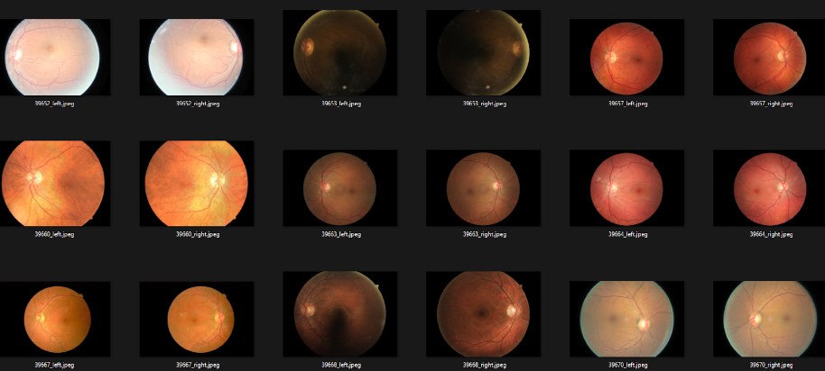

### 1. Resizing to 120 x 120:

The initial step in data processing involved resizing the images to a standardised dimension of 120 x 120 pixels. This resizing was achieved through a combination of downsampling and zero-padding techniques. Downsampling reduces the image resolution while maintaining its aspect ratio, ensuring uniformity across the dataset. Zero-padding was applied to images that did not match the target dimension, ensuring consistency in size for subsequent processing stages.

### 2. Handling Missing Values

Preprocessing the associated metadata involved removing NaN (Not a Number) values from the accompanying CSV file. This process ensured data integrity by eliminating incomplete or inconsistent entries. Additionally, images corresponding to removed entries were excluded from further analysis, maintaining alignment between the image dataset and its associated metadata.

### 3. DataLoader for Mini-Batching

To facilitate efficient training of machine learning models, a DataLoader was implemented to create mini-batches of data. Mini-batching improves training performance by processing smaller subsets of the dataset in each iteration, reducing memory requirements and accelerating computation. The DataLoader abstracts away the complexities of managing data access and batching, allowing seamless integration into the training pipeline.

### 4. Train-Test-Split

Before model training, the dataset was partitioned into separate training and testing subsets using a train-test-split strategy.

## Model Architecture Exploration

The network architecture for the Generator consists of fully connected linear layers with Batch Normalisation and activation function of Leaky Relu. The Generator architecture explored are as follows

1. Conditional Linear GAN (Base). The architecture uses a latent dimension of 20 which creates linear layers of 40x60, 60x60, 60x40, 40x20, and finally the last layer to the image shape. This base model is made simple to kick start the model creation.

2. Conditional Linear GAN (Wide). The architecture is made deeper with more layers with more linear layers with a wider number of neurons to reduce information bottleneck. The architecture uses latent dimension and embedding dimension of 20 which creates linear layers of 40x64, 64x128, 128x128, 128x256, 256x128, 128x64, and finally the last layer to the image shape

3. Conditional Linear GAN (Narrow). Narrower Network with layers of 40x256, 256x128, 128x128, 128x64, 64x16, 16x4, and finally the last layer to the image shape. The architecture is made deeper with more layers however with narrower number of neurons with the intention of condensing the information gradually such that it is close to the output image size. The architecture uses latent dimension and embedding dimension of 20 which creates linear layers of 40x64, 64x128, 128x128, 128x256, 256x128, 128x64, and finally the last layer to the image shape

4. Conditional Convolution GAN. The input noise image, initially shaped (16, 40, 5, 5), undergoes an initial processing block comprising deconvolution, batch normalisation, and Leaky ReLU activation. Simultaneously, the condition tensor, shaped (16, 1), is first linearly transformed into (16, 20, 1, 1), then subjected to a similar processing block, resulting in a shape of (16, 20, 5, 5). These two tensors, now possessing identical width and height dimensions, are concatenated into a unified tensor of shape (16, 60, 5, 5). This combined tensor progresses through three additional deconvolution blocks, each dedicated to upscaling and transforming the data. Ultimately, the output is generated in the form of images, shaped (16, 3, 120, 120), representing the desired synthesised visuals.

5. Conditional Wasserstein Linear Generative Adversarial Networks (cWGAN). Deployed using similar network architecture in no.1, 2, and 3 but with Wassertein distance as loss function

6. Conditional Wasserstein Convolutional Generative Adversarial Networks (cWCGAN). Similar to architecture no.4 but with slight modification to the convolution layer and usage of Wassertein distance as loss function

## Training Procedures

The training procedure starts by initializing the generator and discriminator based on the target model architecture. Key variables such as the loss function, Adam optimizer, learning rate decay, latent_dim, number of classes, lambda for Wasserstein loss, epoch, n_critic, and lists for loss and accuracy history are also initialized.

The training loop runs for the specified number of epochs, iterating over batches of real images and conditions from the training data loader. The discriminator is trained first, followed by the generator after every epoch defined by n_critic.

Training spans 90 epochs, with a learning rate of 0.002 for the first 30 epochs to explore the parameter space, and 0.0002 from epoch 31 onwards for finer adjustments.

The discriminator distinguishes between real and fake images, updating its parameters to minimize the loss based on the predicted probabilities. After a set number of discriminator updates (controlled by n_critic), the generator is trained to produce realistic images to fool the discriminator, updating its parameters to maximize its loss.

Throughout training, metrics such as discriminator accuracy and generator loss are monitored and recorded for evaluation.

## Accuracy and Loss Functions

1. Discriminator Accuracy for Real Images on Real Labels:
2. Discriminator Accuracy for Fake Images on Fake Labels:
3. Discriminator Accuracy for Fake Images on Real Labels:

4. Binary Cross Entropy (BCE)
5. Wasserstein Distance

## Model Inference

Conditional Linear GAN Results (Base, Wide, Narrow)

  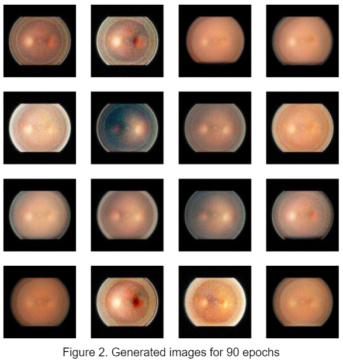
  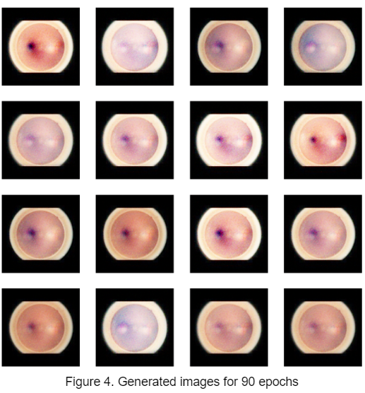 
   

Conditional Linear WGAN Results (Base, Wide, Narrow)

  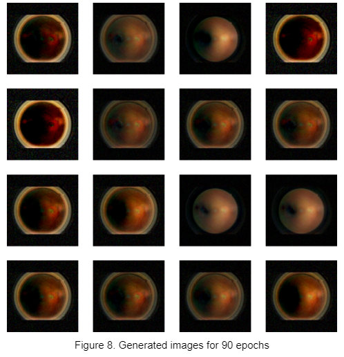
  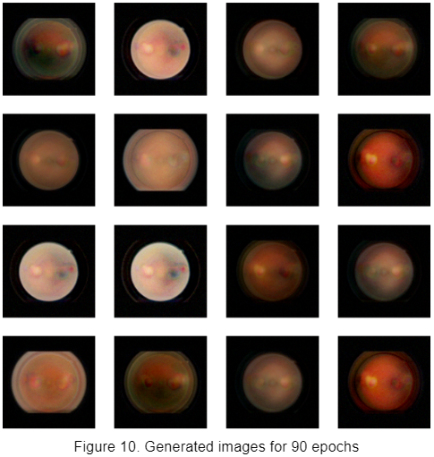 
  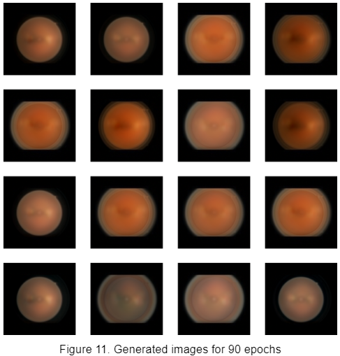 

Convolution cGAN and WGAN

  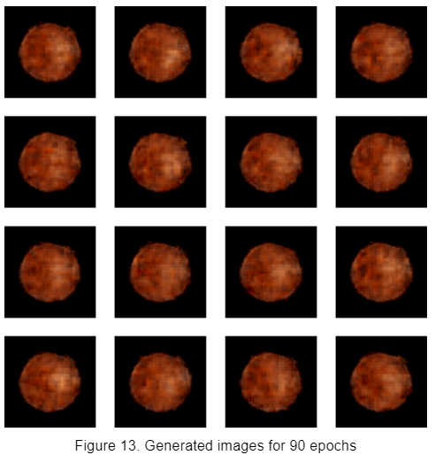
  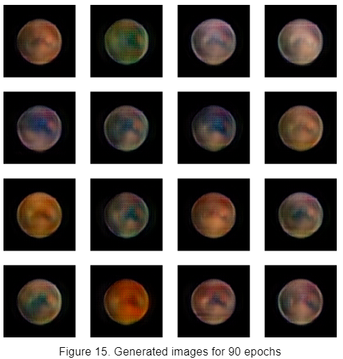 

## Accuracy and Loss results

| Model          | Fake Acc | Real Acc | Gen Acc | Disc Loss | Gen Loss |
| -------------- | -------- | -------- | ------- | --------- | -------- |
| cGAN (Base)    | 0.96     | 0.92     | 0.0     | 0.29      | 4.50     |
| cGAN (Wide)    | 0.93     | 0.94     | 0.04    | 0.58      | 27.50    |
| cGAN (Narrow)  | 0.99     | 0.99     | 0.00    | 0.19      | 22.7     |
| cWGAN (Base)   | 0.50     | 0.53     | 0.50    | 0.68      | 0.03     |
| cWGAN (Wide)   | 0.42     | 0.59     | 0.57    | -0.26     | -9.29    |
| cWGAN (Narrow) | 0.53     | 0.59     | 0.46    | -4.23     | 8.99     |
| cWCGAN         | 0.60     | 0.49     | 0.40    | -2.39     | 33.61    |
| cCGAN          | 0.94     | 0.92     | 0.02    | 0.26      | 5.75     |

From the table, cWGAN (Wide) performs best in terms of Discriminator accuracy fake images on real labels and also has the lowest generator loss, displaying its ability to produce convincing counterfeit images that closely mimic the characteristics of real data, thereby challenging the discriminator's discrimination capabilities. We use this best model for further fine tuning

## Fine Tuning

### n-ciritic exploration (n-critic = 3 and 1)

We used this cWGAN model to further train 30 epochs by changing the n_critic parameter mentioned earlier in the report. We changed this parameter from 5 to 3 and 1 respectively for comparative analysis. The n_critic parameter is responsible for controlling the frequency of discriminator updates relative to generator updates, with the deliberate reduction in the number of discriminator updates per generator update, it allows the generator to be trained more frequently, fostering a faster learning process.

n-critic 3 (left) n-critic=1 (right)

  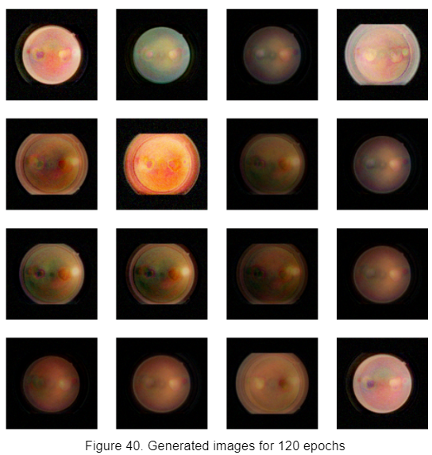
  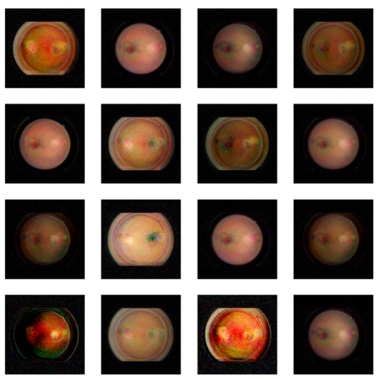 

The following is the results of the exploration of N-ciritic. It is observed that n-critic of 3 gives better results hence we will use n-ciritc 3 for further training

| cGAN (Wide)  | Fake Acc | Real Acc | Gen Acc | Disc Loss | Gen Loss |
| ------------ | -------- | -------- | ------- | --------- | -------- |
| N_critic = 3 | 0.37     | **0.63** | 0.63    | 0.07      | -12.87   |
| N_critic = 1 | 0.75     | 0.25     | 0.25    | 0.34      | 49.43    |

### further continuous training

The model is further trained with increment of 30 epochs resulting in 150, 180, and 210. Then the results are compared in the table below.

| cGAN (Wide)
N_critic = 3 | Fake Acc | Real Acc | Gen Acc | Disc Loss | Gen Loss |
| --- | --- | --- | --- | --- | --- |
| 150 epochs | 0.25 | 0.76 | 0.75 | 0.05 | -24.73 |
| 180 epochs | 0.20 | 0.80 | **0.80** | -0.27 | -29.20 |
| 210 epochs | 0.21 | 0.79 | 0.79 | -0.27 | -31.13 |

## Discussion

After the initial creation of models, including Conditional Generative Adversarial Networks (cGAN), Conditional Convolutional Generative Adversarial Networks (cCGAN), and Conditional Wasserstein Generative Adversarial Networks (cWGAN), model evaluation was conducted to assess their performance in generating retinal images.

Initially, we conducted training sessions for the models spanning 90 epochs. During the initial 30 epochs, we employed a learning rate of 0.002 for the optimizers. This higher learning rate facilitated broader exploration of the parameter space and initial convergence towards promising regions. Subsequently, starting from epoch 31 onwards, we fine-tuned the training process by reducing the learning rate to 0.0002. This adjustment aimed to promote more granular adjustments to the model parameters, enabling finer tuning for improved performance and convergence towards optimal solutions.

The evaluation metrics, encompassing loss values and accuracies of both the Discriminator and Generator, were meticulously analysed and presented in Table 1.

Among the models, the cWGAN with a Wide network emerged as the standout performer, displaying high Generator accuracy coupled with low Generator loss. This suggests the model's adeptness in producing retinal images capable of deceiving the discriminator effectively. Although the discriminator's performance was relatively average compared to other models, it sufficed for the intended use.

Further scrutiny revealed that the distribution of generated images by the cWGAN Wide network closely resembled real retinal images, as depicted in Figure 30. Notably, the generated images captured accurate colours and exhibited dimensional characteristics akin to real-world retinal images.

The unexpected superiority of linear models over convolutional models in certain contexts can be attributed to several factors. Firstly, the linear Wide network may efficiently capture crucial image features due to its inherent structure, which allows for a more direct mapping of inputs to outputs without the complex transformations inherent in convolutional architectures. Additionally, the use of the Wasserstein loss function in training could foster stability by providing a more robust optimization landscape compared to traditional loss functions, such as cross-entropy.

Moreover, linear models have demonstrated a remarkable capability to capture spatial hierarchies and complex features within images. Despite their simplicity in design, linear models are adept at learning and representing intricate relationships between pixels, enabling them to effectively discern patterns and structures within the data. Furthermore, the reduced parameter count of linear models compared to convolutional counterparts can lead to more efficient training and inference processes, as well as potentially mitigating overfitting issues commonly encountered in deep learning models.

Subsequently, the cWGAN Wide network was selected for further refinement through experimentation with varying n_critics parameters. Results, detailed in Table 2, underscored the significance of this parameter in model performance.

Notably, setting n_critics to 3 yielded improved Generator accuracy and reduced losses, indicative of the critical role of discriminator training frequency. When n_critics is set to 3, it means that the generator is updated every three iterations of the discriminator. This relatively higher frequency of generator updates allows the generator to adapt more rapidly to feedback from the discriminator. As a result, the generator can iteratively improve its ability to generate realistic retinal images that deceive the discriminator, leading to enhanced Generator accuracy and reduced losses. Hence, decreasing the n_critic to 3 appears to be advantageous in this context due to its facilitation of more frequent generator updates, enabling quicker adaptation and improvement of the generator's performance.

Given the promising outcome, the model with n_critics=3 underwent additional training epochs, extending to 30, 60, and 90 epochs. Table 3 illustrates the evolving performance metrics over these epochs. Notably, the model displayed a plateau in learning after epoch 180, with further epochs leading to a convergence in performance trends. Consequently, epoch 210 marked the culmination of model refinement, representing the final optimal iteration.

In summary, meticulous evaluation, coupled with strategic refinement through parameter tuning and additional training epochs, culminated in the identification of the cWGAN Wide network with n_critics=3 as the optimal model for retinal image generation in diabetic retinopathy detection.

## Final Images with image distribution graph comparison (with best trained model)

  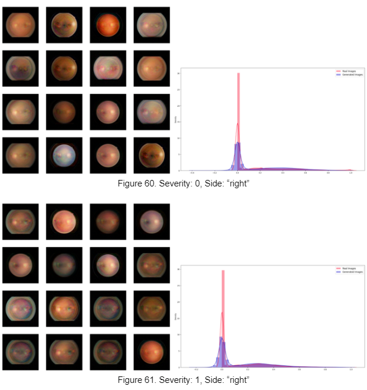
  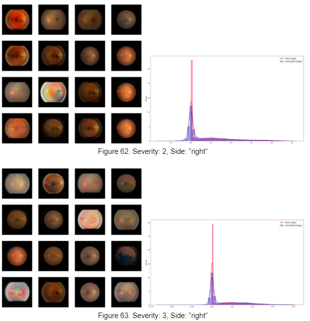 
  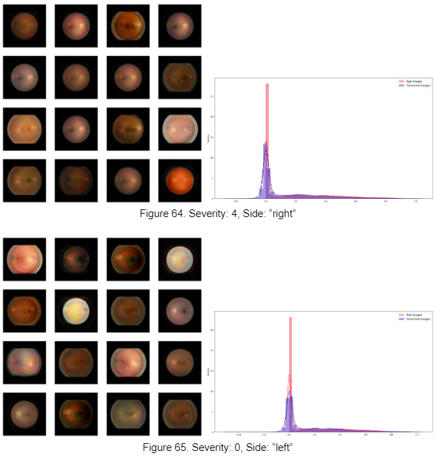 
  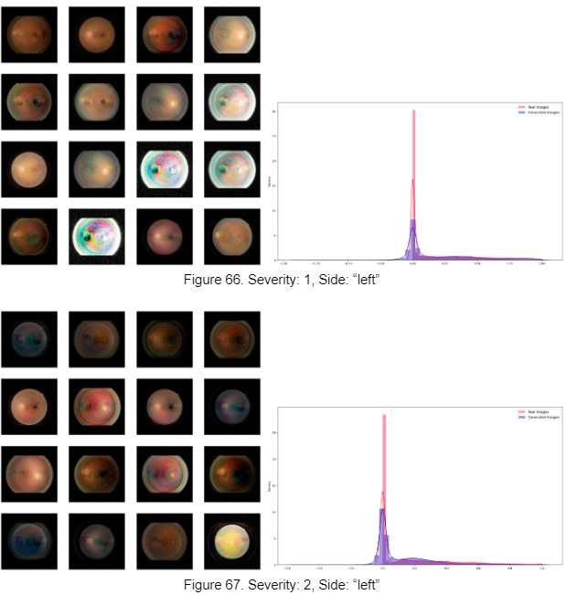 
  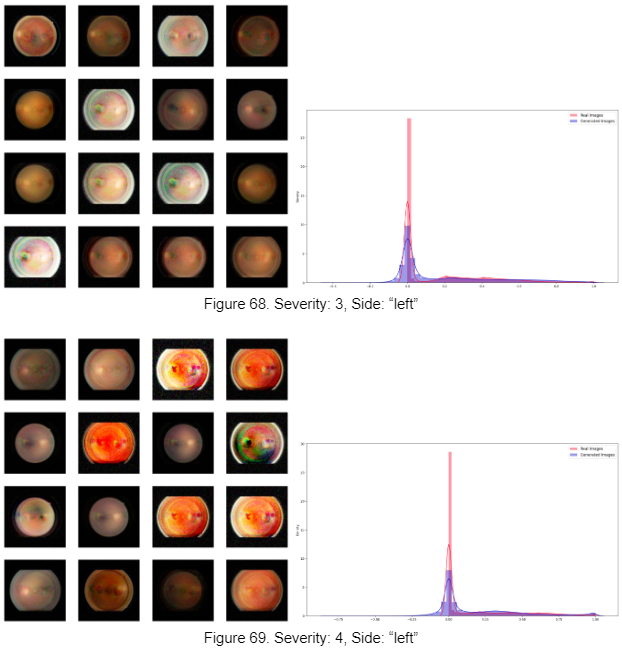 

## Future Direction

Exploration of Deeper Architectures: Given sufficient computational resources, future work could involve exploring deeper layers and wider architectures to improve the model's capacity to capture intricate image features and nuances. This could potentially enhance the quality and diversity of generated images, contributing to more realistic outputs.

Improvements to Current Models: Alongside exploring new architectures, continuous refinement and optimization of existing models are essential. This includes experimenting with alternative normalisation techniques, activation functions, and regularisation methods to enhance model stability, convergence, and colour reproduction capabilities. Additionally, investigating novel training strategies, such as curriculum learning or progressive growing of GANs, may yield further improvements in image generation quality and training efficiency.

Coarse-to-Fine Approaches: Investigating coarse-to-fine network architectures, such as U-Net-based models, offers promising avenues for improving image generation quality. By progressively refining generated outputs at multiple scales, these architectures can produce more detailed and coherent images, potentially mitigating challenges associated with high-resolution generation.

Incorporation of Attention Mechanisms: Integrating attention mechanisms, such as those found in Vision Transformers (ViTs), within convolutional or diffusion models can enhance the model's ability to focus on relevant image regions during generation. Attention blocks can facilitate more granular and detailed image synthesis, leading to higher-quality outputs with improved spatial coherence and structure.
